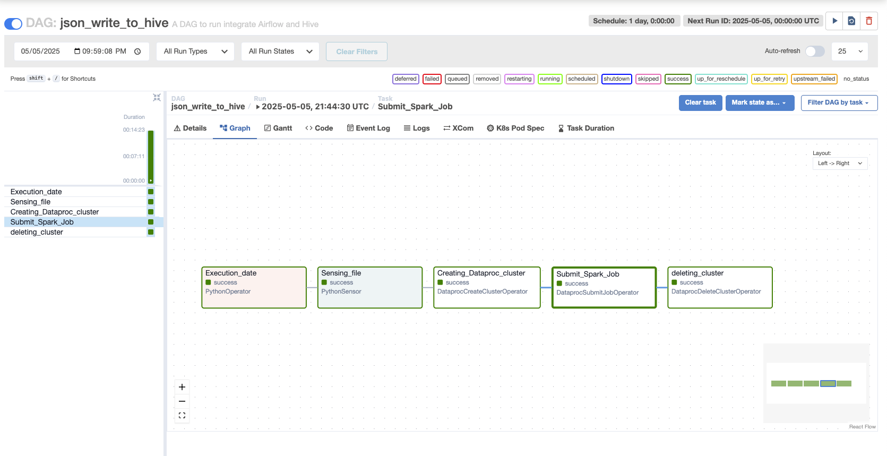

# Airflow Assignment 2 – Load JSON Data from GCS to Hive on Dataproc



## 📌 Objective

This project implements an Apache Airflow DAG that performs the following:

- Dynamically fetches a daily employee JSON (CSV in this case) file from a Google Cloud Storage (GCS) bucket.
- Validates the file's existence using a Python-based sensor.
- Spins up a Dataproc cluster on GCP.
- Submits a PySpark job to:
  - Filter employees with salaries greater than 50,000.
  - Store the filtered data into a Hive table (`EMP_DB.filtered_employee`).
  - Write the same filtered data as a Parquet file into a GCS path.

---

## 🧰 Tech Stack

- **Airflow** (Python DAG)
- **Google Cloud Platform**
  - Cloud Storage
  - Dataproc
- **Apache Spark** (via PySpark)
- **Hive** (on Dataproc)
- **Python**

---

## 📁 File Structure

```bash
.
├── dags/
│   └── json_write_to_hive.py        # Airflow DAG
├── spark_job/
│   └── spark_job.py                 # PySpark job script
└── employee-<yyyymmdd>.csv         # Daily input files (in GCS)

